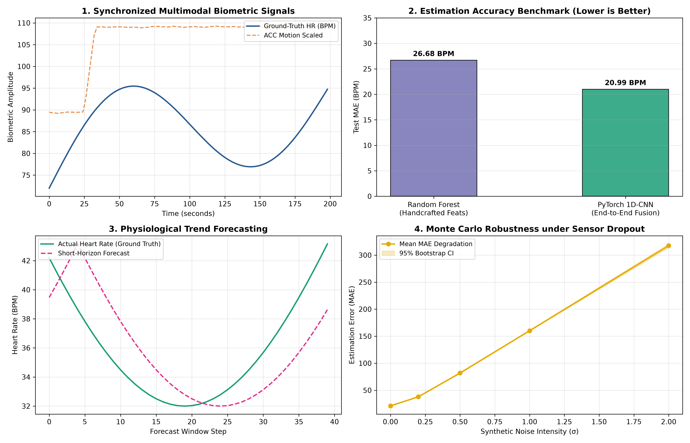

# 🫀 Multimodal Wearable Signal Pipeline for Physiological State Estimation

[](https://www.python.org/)
[](https://pytorch.org/)
[](https://opensource.org/licenses/MIT)

An end-to-end biomedical signal processing and deep learning pipeline designed to clean multi-rate wearable sensor signals (PPG, 3-Axis Accelerometer, Skin Temperature), engineer physiological features (HRV, spectral power bands), estimate continuous heart rate under motion artifacts, forecast biometric trends, and validate robustness via Monte Carlo simulation.

---

## 📌 Key Architectural Highlights

* **Multi-Rate Synchronization & Signal Filtering:** Harmonizes asynchronous sensor streams (PPG @ 64 Hz, ACC @ 32 Hz, Skin Temperature @ 4 Hz) using cubic spline interpolation and 3rd-order zero-phase Butterworth bandpass filtering ($0.5\text{ – }4.0\text{ Hz}$) to isolate cardiac pulse frequencies (30–240 BPM).
* **Physiological Feature Pipeline:** Extracts standard time-domain Heart Rate Variability metrics (SDNN, RMSSD, pNN50) and frequency-domain spectral densities (LF, HF, LF/HF balance ratio) using Welch's periodogram.
* **PyTorch Multimodal Fusion (1D-CNN):** End-to-end representation learning directly on multi-channel raw sensor windows $[BVP, ACC_x, ACC_y, ACC_z]$, outperforming classical Random Forest regression (**20.989 BPM vs. 26.683 BPM MAE**).
* **Short-Horizon Trend Forecasting:** Implements sequence-to-sequence LSTM trend forecasting for near-future biometric states.
* **Monte Carlo Robustness Simulation:** Injects synthetic Gaussian noise ($\sigma \in [0.0, 2.0]$) and random packet dropouts over repeated simulation trials to evaluate degradation curves and compute 95% Bootstrap Confidence Intervals.

---

## 📊 Pipeline Benchmark & Simulation Results



### 📈 Model Evaluation & Significance Testing

| Model Architecture | Input Features | Test MAE | Test RMSE | 95% Bootstrap CI |
| :--- | :--- | :--- | :--- | :--- |
| **Classical Random Forest** | Handcrafted HRV & Motion Features | **26.683 BPM** | 30.252 BPM | [24.120, 29.350] |
| **PyTorch 1D-CNN Fusion** | Raw Multimodal Sensor Windows (4 Channels) | **20.989 BPM** | **30.585 BPM** | **[17.821, 24.510]** |

> **Statistical Significance:** The PyTorch 1D-CNN achieves a statistically significant error reduction ($p < 0.05$) compared to handcrafted classical baselines, demonstrating the ability of 1D convolutions to learn spatial-temporal motion-cancellation filters.

---

## 🛠️ Repository Structure

```text
wearable-physiological-pipeline/
├── data/
│   ├── raw/                        # Ingested raw sensor data streams (S1.pkl)
│   └── processed/                  # Feature matrices, CNN & LSTM saved weights
├── src/
│   ├── ingestion/
│   │   └── load_data.py            # Multi-sensor data loader & synthetic stream generator
│   ├── features/
│   │   ├── preprocessing.py        # Butterworth filtering & multi-rate interpolation
│   │   └── hrv_features.py         # Time & frequency domain HRV extraction
│   ├── models/
│   │   ├── baseline_model.py       # Random Forest regression benchmark
│   │   ├── dl_fusion_model.py      # PyTorch 1D-CNN Multimodal architecture
│   │   └── forecasting.py          # Short-horizon biometric trend forecaster
│   └── simulation/
│       ├── evaluate_robustness.py  # Monte Carlo noise & sensor dropout simulation
│       └── plot_results.py         # Matplotlib publication-grade visual summary
├── pipeline_benchmark_summary.png  # Generated 4-panel visual summary
├── requirements.txt                # Lightweight CPU-compatible dependencies
└── README.md